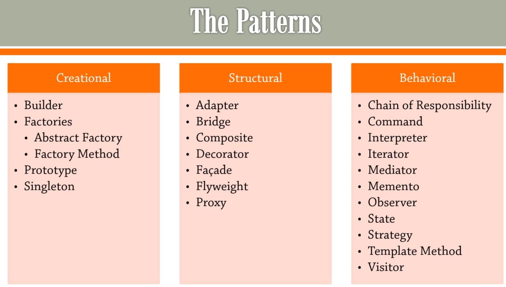

# Python Design Patterns Examples

- ###### [SOLID principles](solid_principles.md)
- ###### [Creational](creational_patterns.md)
- ###### [Structural](structural_patterns.md)
- ###### [Behavioral](behavioral_patterns.md)
